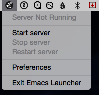
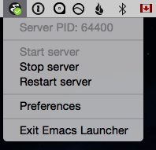
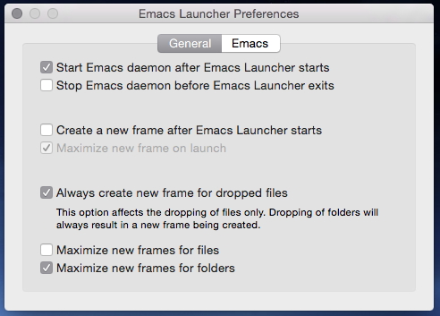
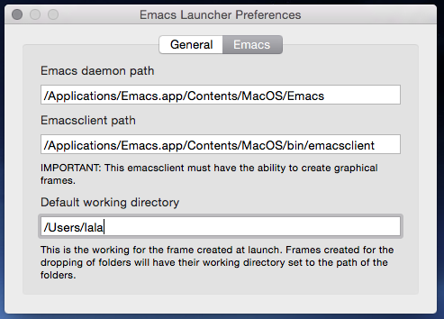

# Emacs Launcher

_-- an OS X menubar app to conveniently manage Emacs in server/client mode and offers OS X integrations such as Drag'n Drop and "Open with ..." support._

[Download Emacs Launcher](https://github.com/qiushihe/emacs-launcher/raw/master/Emacs Launcher.app.zip)

[Download Emacs for OS X](http://emacsformacosx.com) if you haven't already ...

## Why?

Emacs launches slowly. Every time you run `emacs some.file` a new instance of Emacs is launched and it takes a _really long time_ to load all the scripts/plugins/etc before you can actually edit the file.

There is a faster way to use Eamcs. Emacs can be used in server/client mode where the server only need to be launched once (via `emacs --daemon`) and each client can be launched pretty much instantly (via `emacsclient some.file`) and connect to the server to do the editing.

However, having to manually launch Emacs server/client in a terminal is tedious. More importantly, having to manually keep track of a running server in the terminal just isn't a very OS X way of doing things.

So in comes **Emacs launcher**, an OS X menubar app to conveniently manage Emacs in server/client mode and offers OS X integrations such as **Drag'n Drop** and **"Open with ..."** support.

## What does it do?

The way Emacs Launcher works is very simply. You can open files with Emacs Launcher by either ...

* Dragging'n Dropping onto the menubar icon; or ...
* Selecting "Open with ..." from Finder

... and at which point Emacs Launcher will ...

1. Check if there is a running instance of Emacs in daemon mode, and if there isn't then launch one
2. Launch an instance of Emacs client to connect the the daemon from the previous step

Really? _"Ensure server is running before launching client to connect to it."_ That sounds like something that should be built into Emacs, if you ask me.

## Screen shots

And this is what Emacs Launcher looks like:

From the preferences window screen shots below you can see that Emacs Launcher comes with a few modern conveniences as well:

## Alternative

If graphical user interface it just not your thing but you still want the convenience of a managed Emacs server/client setup (i.e. the _Ensure server is running before launching client to connect to it_ part), you can use this handy shell script instead: https://github.com/qiushihe/dotpiles/blob/master/emacs/emacsl.sh. As an added bonus the shell script is comptiable of Emacs Launcher (i.e. they can start/stop/restart each other's server instance).

## TODO

* Automically detect the presence of Emacs.app from common locations
* Show preferences windows's "Emacs" tab when auto detection of Emacs location fails

## Disclaimers

Emacs Launcher has been quite thoroughly tested _on my computers_ which run OS X 10.10 and Emacs from here: http://emacsformacosx.com. so it's entirely possible that it won't work well in other environments.
